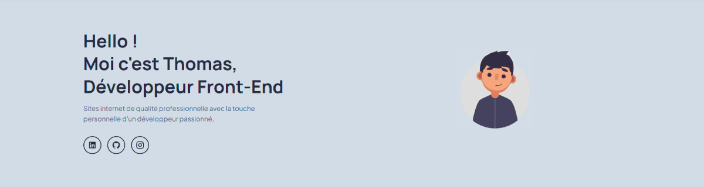

# Portfolio Professionnel - Thomas Sifferle 🚀


[](https://github.com/TomSif)
[](https://reactjs.org/)
[](https://vitejs.dev/)
[](https://sass-lang.com/)

<a href="#description-fr-">🇫🇷 README en Français</a> - <a href="#en-description">🇺🇸 English README</a>

---

## Description FR :

Portfolio de développeur Front-End créé dans le cadre de la formation [OpenClassrooms](https://openclassrooms.com/fr/paths/900-developpeur-web) - Développeur Web.

> **Mission** : Créer un portfolio professionnel moderne pour présenter mes compétences et projets
>
> #### Compétences démontrées :
>
> - ✅ Développement d'applications React modernes avec hooks
> - 🎨 Création d'interfaces responsive et accessibles
> - ⚡ Optimisation des performances web (SEO, Lighthouse)
> - 🎭 Animations fluides avec Framer Motion

### 🌐 Démo Live :

**[Voir le portfolio en ligne →](https://thomas-sifferle-portfolio.vercel.app)**

Déployé sur Vercel avec HTTPS et optimisations de performance.

---

## 🚀 Technologies utilisées

**Frontend :**

- **React 19** - Bibliothèque JavaScript pour interfaces utilisateur
- **React Router v7** - Navigation et routing
- **Vite** - Build tool et dev server ultra-rapide
- **Sass** - Préprocesseur CSS avec architecture 7-1
- **Framer Motion** - Animations fluides et performantes
- **React Icons** - Bibliothèque d'icônes
- **Formspree** - Gestion du formulaire de contact

**Outils de développement :**

- **Git** / **GitHub** - Versioning
- **ESLint** - Qualité du code
- **Vercel** - Déploiement continu

---

## 📦 Installation

### Prérequis :

- **Node.js** (v18 ou supérieur)
- **npm** ou **yarn**
- **Git**

### 📥 Cloner le projet :

```bash
git clone https://github.com/TomSif/portfolio.git
cd portfolio
```

### 🔧 Installation :

1. Installez les dépendances :

```bash
npm install
```

2. Lancez le serveur de développement :

```bash
npm run dev
```

L'application sera accessible sur `http://localhost:5173`

---

## 📱 Projets présentés

### Projets principaux (Featured)

#### 1️⃣ **Sophie Bluel - Portfolio Architecte**


- JavaScript ES6+ vanilla (sans framework)
- Manipulation du DOM et événements
- Intégration API REST avec authentification JWT
- Système d'administration complet (CRUD)

🔗 [GitHub](https://github.com/TomSif/TomSif-OpenClassRooms_Projet-6_Sophie-Bluel) | [Démo](https://tom-sif-open-class-rooms-projet-6-sophie-bluel.vercel.app/index.html)

#### 2️⃣ **Argent Bank - Application Bancaire**


- React 19 avec Redux Toolkit pour la gestion d'état
- Authentification JWT complète (login, logout, persistance)
- Architecture modulaire avec slices Redux
- Interface responsive et performante

🔗 [GitHub](https://github.com/TomSif/OpenClassRooms_Projet-10_Argent-Bank)

### Autres projets

- **Kasa** - Location immobilière (React, React Router, Sass)
- **Nina Carducci** - Optimisation SEO et accessibilité
- **OhMyFood** - Animations CSS avancées
- Projets personnels et photographie

---

## 🎯 Caractéristiques

### Architecture et organisation

- ✅ **Design System complet** défini dans Sass avec variables centralisées (couleurs, typographie, espacements)
- ✅ **Architecture SCSS 7-1** (abstracts, base, components, pages)
- ✅ **Composants React réutilisables** avec props typées
- ✅ **Routing hybride** : One-page avec sections + pages dédiées aux projets détaillés
- ✅ **Données centralisées** dans `/src/data/` pour faciliter la maintenance

### Performance et optimisation

- ⚡ **SEO optimisé** : Balises meta, Open Graph, Twitter Cards, sitemap.xml, robots.txt
- ♿ **Accessibilité** : Navigation clavier, ARIA labels, sémantique HTML5
- 📱 **Responsive Design** : Mobile-first avec breakpoints 375px, 768px, 1024px+
- 🚀 **Optimisations** : Lazy loading, images WebP, preconnect fonts
- 💯 **Score Lighthouse** : Performance 95+, Accessibilité 100, SEO 100

### UX et interactions

- 🎭 **Animations Framer Motion** : Transitions fluides et micro-interactions
- 🖼️ **Lightbox intelligente** : Deux modes (projets code vs projets visuels)
- 🏷️ **Système de catégories** : Scholar, Personal, Photography, Graphic Design
- 📧 **Formulaire de contact** : Validation en temps réel, messages de feedback
- 🧭 **Navigation intuitive** : Ancres, smooth scroll, états actifs

---

## 🗂️ Structure du projet

```
portfolio/
├── public/
│   ├── images/              # Images optimisées (WebP)
│   ├── robots.txt          # SEO
│   └── sitemap.xml         # Plan du site
├── src/
│   ├── components/         # Composants React réutilisables
│   │   ├── Header.jsx
│   │   ├── Footer.jsx
│   │   ├── ProjectCard.jsx
│   │   ├── Lightbox.jsx
│   │   └── ContactForm.jsx
│   ├── pages/              # Pages (Home, ProjectPage)
│   │   ├── Home.jsx
│   │   └── ProjectPage.jsx
│   ├── data/               # Données centralisées
│   │   ├── projects.js
│   │   └── techConfig.js
│   └── styles/             # SCSS avec architecture 7-1
│       ├── abstracts/      # Variables, mixins, functions
│       ├── base/           # Reset, typography, animations
│       ├── components/     # Styles des composants
│       └── pages/          # Styles des pages
├── .claude/                # Documentation pour Claude Code
├── package.json
└── vite.config.js
```

---

## 🛠️ Scripts disponibles

```bash
# Développement
npm run dev              # Lance le serveur de développement

# Production
npm run build            # Compile pour la production
npm run preview          # Prévisualise le build de production

# Qualité du code
npm run lint             # Vérifie le code avec ESLint
```

---

## 🎨 Design System

### Palette de couleurs

| Couleur       | Hex       | Usage                 |
| ------------- | --------- | --------------------- |
| **Primary**   | `#fd853a` | CTA, liens, accents   |
| **Secondary** | `#0088ff` | Titres, éléments clés |
| **Dark**      | `#2c3e50` | Texte principal       |
| **Light**     | `#f8f9fa` | Arrière-plans         |

### Typographie

- **Montserrat** - Titres principaux
- **Poppins** - Navigation et boutons
- **Plus Jakarta Sans** - Corps de texte
- **Manrope** - Texte secondaire

### Espacements

Système basé sur des multiples de 8px pour une cohérence visuelle :

```scss
$spacing-xs: 0.5rem; // 8px
$spacing-sm: 1rem; // 16px
$spacing-md: 1.5rem; // 24px
$spacing-lg: 2rem; // 32px
$spacing-xl: 3rem; // 48px
```

Toutes les variables sont centralisées dans `src/styles/abstracts/_variables.scss`

---

## 🎓 Contexte du projet

Projet de fin de formation **OpenClassrooms - Développeur Web Front-End** (Bac+2).

### Objectifs pédagogiques :

- ✅ Démonstration des compétences techniques acquises
- ✅ Création d'une vitrine professionnelle
- ✅ Application des bonnes pratiques (SEO, accessibilité, performance)
- ✅ Gestion de projet de A à Z

---

## 📧 Contact

- **Portfolio** : [thomas-sifferle-portfolio.vercel.app](https://thomas-sifferle-portfolio.vercel.app)
- **GitHub** : [@TomSif](https://github.com/TomSif)
- **LinkedIn** : [Thomas Sifferle](https://www.linkedin.com/in/thomas-sifferle)
- **Localisation** : Strasbourg, France 🇫🇷 (Remote possible)

---

## 👨‍💻 Auteur :

**Thomas Sifferle** - Développeur Front-End Junior disponible pour CDI

Spécialisé React, JavaScript, Sass

---

## EN Description

Professional Front-End Developer Portfolio created as part of the [OpenClassrooms](https://openclassrooms.com/fr/paths/900-developpeur-web) - Web Developer training program.

> **Mission**: Create a modern professional portfolio to showcase my skills and projects
>
> #### Skills demonstrated:
>
> - ✅ Modern React application development with hooks
> - 🎨 Responsive and accessible interface creation
> - ⚡ Web performance optimization (SEO, Lighthouse)
> - 🔄 State management with Redux Toolkit
> - 🎭 Smooth animations with Framer Motion

### 🌐 Live Demo:

**[View portfolio online →](https://thomas-sifferle-portfolio.vercel.app)**

Deployed on Vercel with HTTPS and performance optimizations.

---

## 🚀 Technologies used

**Frontend:**

- **React 19** - JavaScript library for user interfaces
- **React Router v7** - Navigation and routing
- **Vite** - Ultra-fast build tool and dev server
- **Sass** - CSS preprocessor with 7-1 architecture
- **Framer Motion** - Smooth and performant animations
- **React Icons** - Icon library
- **Formspree** - Contact form management

**Development tools:**

- **Git** / **GitHub** - Version control
- **ESLint** - Code quality
- **Vercel** - Continuous deployment

---

## 📦 Installation

### Prerequisites:

- **Node.js** (v18 or higher)
- **npm** or **yarn**
- **Git**

### 📥 Clone the project:

```bash
git clone https://github.com/TomSif/portfolio.git
cd portfolio
```

### 🔧 Setup:

1. Install dependencies:

```bash
npm install
```

2. Start development server:

```bash
npm run dev
```

Application will be accessible at `http://localhost:5173`

---

## 📱 Featured Projects

### Main Projects

#### 1️⃣ **Sophie Bluel - Architect Portfolio**


- Vanilla JavaScript ES6+ (no framework)
- DOM manipulation and events
- REST API integration with JWT authentication
- Complete administration system (CRUD)

🔗 [GitHub](https://github.com/TomSif/TomSif-OpenClassRooms_Projet-6_Sophie-Bluel) | [Demo](https://tom-sif-open-class-rooms-projet-6-sophie-bluel.vercel.app/index.html)

#### 2️⃣ **Argent Bank - Banking Application**


- React 19 with Redux Toolkit for state management
- Complete JWT authentication (login, logout, persistence)
- Modular architecture with Redux slices
- Responsive and performant interface

🔗 [GitHub](https://github.com/TomSif/OpenClassRooms_Projet-10_Argent-Bank)

### Other Projects

- **Kasa** - Real estate rental (React, React Router, Sass)
- **Nina Carducci** - SEO and accessibility optimization
- **OhMyFood** - Advanced CSS animations
- Personal projects and photography

---

## 👨‍💻 Author:

**Thomas Sifferle** - Junior Front-End Developer available for permanent contract

Specialized in React, JavaScript, Sass

---

_Made with ❤️ and React_
